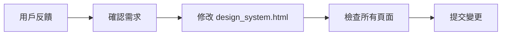

# 🎨 台指選擇權分析系統 - 設計系統總覽

## 📦 文件清單

本專案已建立完整的設計系統 (Design System)，包含以下文件：

### 核心文件

- **`templates/design_system.html`** - 設計系統核心 CSS 文件 (唯一需要修改的樣式文件)
- **`templates/example_page.html`** - 完整示範頁面，展示所有組件用法

### 文檔

- **`DESIGN_GUIDELINE.md`** - 完整設計指南 (14 章節，詳細說明)
- **`DESIGN_QUICK_REFERENCE.md`** - 快速參考卡片 (常用組件速查)
- **`DESIGN_MIGRATION_GUIDE.md`** - 遷移指南 (舊代碼轉換對照表)
- **`DESIGN_SYSTEM_README.md`** - 本文件 (總覽)

---

## 🎯 設計系統的優勢

### Before (舊方式)

```html
<!-- settlement_report.html 第 860 行 -->
<div
  style="background: white; padding: 12px 15px; border-radius: 8px; 
            border-left: 4px solid #8b5cf6; display: flex; 
            justify-content: space-between; align-items: center;"
>
  <span style="font-size: 0.85rem; color: #6b21a8; font-weight: 600;">
    📈 預測準確度：
  </span>
  <span style="font-size: 1.2rem; font-weight: 700; color: #5b21b6;">
    100%
  </span>
</div>

<!-- report.html 第 450 行 - 相似但不一致的樣式 -->
<div
  style="background: white; padding: 15px; border-radius: 8px; 
            border-left: 4px solid #2563eb;"
>
  <div style="font-size: 0.85rem; color: #64748b;">預測準確度</div>
  <div style="font-size: 1.5rem; font-weight: 700; color: #2563eb;">100%</div>
</div>
```

**問題**:

- ❌ 樣式分散在 3 個文件中
- ❌ 相似組件但樣式不一致
- ❌ 想調整字體大小需要修改 100+ 處
- ❌ 移動端適配需要大量重複的 media query

### After (設計系統)

```html
<!-- 所有頁面統一使用 -->
<div class="data-bar purple">
  <span class="data-bar-label">📈 預測準確度：</span>
  <span class="data-bar-value">100%</span>
</div>
```

**優勢**:

- ✅ 樣式統一管理在 `design_system.html`
- ✅ 所有頁面自動一致
- ✅ 調整字體只需改一處 (`:root { --font-base: 1.5rem; }`)
- ✅ 移動端自動適配，無需額外代碼

---

## 🚀 快速開始

### 1. 查看示範頁面

```bash
# 開啟範例頁面看所有組件
open templates/example_page.html
```

### 2. 在新頁面使用設計系統

```html
<!DOCTYPE html>
<html lang="zh-TW">
  <head>
    <meta charset="UTF-8" />
    <meta name="viewport" content="width=device-width, initial-scale=1.0" />
    <title>我的新頁面</title>

    <!-- 引入設計系統 -->
    
  </head>
  <body>
    <div class="container">
      <header class="page-header">
        <h1>頁面標題</h1>
      </header>

      <div class="section">
        <div class="section-header">
          <span class="section-icon">📊</span>
          <h2 class="section-title">數據分析</h2>
        </div>

        <!-- 使用組件 -->
        <div class="data-bar primary">
          <span class="data-bar-label">📈 標籤：</span>
          <span class="data-bar-value">數值</span>
        </div>
      </div>
    </div>
  </body>
</html>
```

### 3. 調整全局樣式

```css
/* 只需修改 templates/design_system.html */
:root {
  --primary-color: #3b82f6; /* 改主色調 */
  --font-lg-mobile: 1.5rem; /* 調移動端字體 */
  --space-lg: 24px; /* 調間距 */
}
```

---

## 📚 學習路徑

### 新手路徑 (15 分鐘)

1. 閱讀 `DESIGN_QUICK_REFERENCE.md` (5 分鐘)
2. 查看 `example_page.html` 源碼 (5 分鐘)
3. 試著創建一個簡單頁面 (5 分鐘)

### 進階路徑 (45 分鐘)

1. 閱讀 `DESIGN_GUIDELINE.md` 完整指南 (20 分鐘)
2. 閱讀 `DESIGN_MIGRATION_GUIDE.md` 遷移指南 (10 分鐘)
3. 將現有頁面遷移到設計系統 (15 分鐘)

### 專家路徑

1. 研究 `design_system.html` 的實現細節
2. 根據專案需求自定義組件
3. 擴展設計系統添加新組件

---

## 🔧 維護指南

### 日常開發

#### ✅ 正確做法

```html
<!-- 使用預定義組件 -->
<div class="data-bar primary">
  <span class="data-bar-label">標籤：</span>
  <span class="data-bar-value">{{ value }}</span>
</div>
```

#### ❌ 錯誤做法

```html
<!-- 不要使用 inline styles -->
<div style="background: white; padding: 15px; border-left: 4px solid #2563eb;">
  <span style="font-size: 0.85rem;">標籤：</span>
  <span style="font-size: 1.2rem;">{{ value }}</span>
</div>
```

### 全局調整流程



**範例**: 用戶反饋「移動端字太小」

```bash
# 步驟 1: 修改設計系統
vim templates/design_system.html

# 步驟 2: 調整移動端字體變數
:root {
    --font-xl-mobile: 1.65rem;   /* 從 1.5rem 增加 10% */
    --font-lg-mobile: 1.43rem;   /* 從 1.3rem 增加 10% */
    # ...依此類推
}

# 步驟 3: 重新生成所有報告
python3 generate_all_reports.py

# 步驟 4: 測試移動端顯示
# 開啟多個報告頁面，使用瀏覽器開發者工具切換到手機模式驗證
```

---

## 📊 設計系統統計

### 組件數量

- **Layout Components**: 5 個 (Container, Section, Section Header, Grid, Flex)
- **Card Components**: 4 個 (Card, Data Card, Data Bar, Info Card)
- **Header Components**: 2 個 (Page Header, Info Items)
- **Tab Components**: 2 個 (Tabs Container, Tab Button)
- **Typography**: 8 個字體級別 + 3 個粗細 + 5 個顏色
- **Special**: 5 個 (Gradient Backgrounds, Scrollable, Empty State, Charts, Footer)
- **Utilities**: 20+ 工具類

### 設計變數

- **色彩**: 10 個主要顏色 + 5 個漸層
- **字體**: 9 個桌面級別 + 9 個移動級別
- **間距**: 7 個級別 (桌面 + 移動各 7 個)
- **圓角**: 3 個級別
- **陰影**: 4 個級別

### 代碼減少

- **Before**: ~300 行重複的 inline styles
- **After**: ~20 行組件 classes
- **減少**: ~93% ✅

---

## 🎯 常見使用情境

### 情境 1: 創建新的結算報告頁面

```html


<div class="container">
  <header class="page-header">
    <h1>{{ settlement_date }} 結算報告</h1>
    <div class="info-items">
      <div class="info-item">
        <div class="info-label">結算價</div>
        <div class="info-value">{{ price }}</div>
      </div>
    </div>
  </header>

  <div class="section gradient-primary">
    <div class="section-header">
      <span class="section-icon">📊</span>
      <h2 class="section-title">數據分析</h2>
    </div>

    <div class="data-bar primary">
      <span class="data-bar-label">📈 準確度：</span>
      <span class="data-bar-value">{{ accuracy }}%</span>
    </div>
  </div>
</div>
```

### 情境 2: 添加移動端友好的數據展示

```html
<!-- 自動在移動端切換為單行格式 -->
<div class="grid grid-4">
  <!-- 桌面：4 欄，移動端：2 欄 -->
  
  <div class="data-card">
    <div class="data-card-label">{{ item.label }}</div>
    <div class="data-card-value text-primary">{{ item.value }}</div>
  </div>
  
</div>

<!-- 或使用更節省空間的單行格式 -->

<div class="data-bar primary">
  <span class="data-bar-label">{{ item.label }}：</span>
  <span class="data-bar-value">{{ item.value }}</span>
</div>

```

### 情境 3: 統一調整品牌色

```css
/* templates/design_system.html */
:root {
  /* 從藍色系改為綠色系 */
  --primary-color: #10b981;
  --primary-dark: #059669;
}
```

✅ 影響：所有按鈕、連結、標題、圖標等自動變色

---

## 🔍 疑難排解

### Q: 為什麼我的樣式沒有生效？

A: 確認已在 `<head>` 中引入 ``

### Q: 如何覆寫某個組件的樣式？

A: 在 `` 後添加自定義 `<style>`，使用更高的 specificity

```html

<style>
  .my-custom-section .data-bar {
    background: #f0f0f0; /* 只影響這個 section */
  }
</style>
```

### Q: 移動端樣式如何測試？

A:

```bash
# 方法 1: 瀏覽器開發者工具
# Chrome/Edge: F12 → Toggle device toolbar (Ctrl+Shift+M)

# 方法 2: 實際手機測試
# 1. 啟動本地服務器
python3 -m http.server 8000

# 2. 手機連接同一 Wi-Fi，訪問
http://你的電腦IP:8000/docs/settlement_20260109_fri.html
```

### Q: 如何添加新組件？

A:

1. 在 `design_system.html` 中定義新組件樣式
2. 更新 `DESIGN_GUIDELINE.md` 文檔
3. 在 `example_page.html` 中添加示例
4. 在 `DESIGN_QUICK_REFERENCE.md` 中添加速查

---

## 📞 支持與貢獻

### 獲取幫助

- 📖 查看文檔: `DESIGN_GUIDELINE.md`
- 💡 查看範例: `templates/example_page.html`
- 🔍 查看對照表: `DESIGN_MIGRATION_GUIDE.md`

### 報告問題

如發現設計系統的問題，請提供：

1. 問題截圖
2. 瀏覽器版本
3. 桌面端 / 移動端
4. 預期效果 vs 實際效果

### 貢獻新組件

1. Fork 專案
2. 在 `design_system.html` 添加新組件
3. 在 `example_page.html` 添加示例
4. 更新相關文檔
5. 提交 Pull Request

---

## 🗺️ 路線圖

### v1.0 (當前版本)

- ✅ 完整設計變數系統
- ✅ 14 類核心組件
- ✅ 桌面 + 移動端響應式
- ✅ 完整文檔

### v1.1 (計劃中)

- ⏳ 深色模式支持
- ⏳ 更多色彩主題選項
- ⏳ 動畫效果系統
- ⏳ 可訪問性 (a11y) 增強

### v2.0 (未來)

- 🔮 組件庫分離
- 🔮 CSS 變數實時編輯器
- 🔮 自動生成組件文檔

---

## 📄 授權

本設計系統與台指選擇權分析系統共享相同授權。

---

**最後更新**: 2026 年 1 月 12 日  
**版本**: v1.0  
**維護者**: ShoppingLiao
